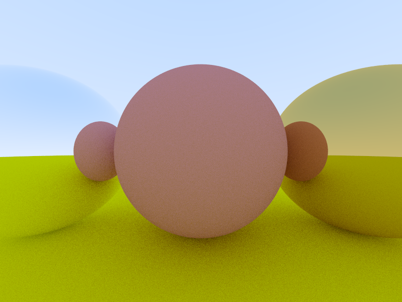

## Lambertian--散射

朗伯反射，又称理想反射。

他可以有一个系数R，可以选择不断散射并按R比例系数衰减而毫无吸收，或者按(1-R)的比例吸收光线而无散射，或者两者均存。

```c++
class Lambertian : public Material {
public:
    Lambertian(const Color& a) : albedo(a) {}

    virtual bool scatter(
        const Ray& r_in, const hit_record& rec, Color& attenuation, Ray& scattered
    ) const override {
        //取随机反射方向，但是没有考虑到法向量的方向，将会出现二者方向相反
        //于是可能出现scatter_direction非常接近零向量的情况
        //最终导致Nan与Inf
        auto scatter_direction = rec.normal + random_unit_vector(); 
        if (scatter_direction.near_zero())
            scatter_direction = rec.normal;
        scattered = Ray(rec.p, scatter_direction);
        attenuation = albedo;
        return true;
    }

public:
    Color albedo;
};
```

对于外部的调用者而言

```c++
Color attenuation;
Ray scattered;
if (rec.mat_ptr->scatter(r, rec, attenuation, scattered))
		return attenuation * ray_color(scattered, world, depth - 1);
```

该材质只做了两件事，一是提供了衰减率`attenuation`，二是提供了下一`depth`的散射方向

## 去躁AA

注意到该方向是在点半球内任一采样方向(为了严谨，可以进行多次采样并取均值)。

```c++
Color res;
for(0->n)
{
	...
	res += attenuation * ray_color(scattered, world, depth - 1);
}
res /= n;
```

但这会引发一个问题，射线数目呈指数膨胀，即便`n`取2也无法忍受,2^depth...太多了！唯一的方式是设置n为1。

于是又回到了原点，如何解决采样去噪问题？

回到Ray_color的最上层调用，多次重复即可。

```c++
		int Random_sample_pixel = 50;
		for (int i = image_height - 1; i >= 0; --i)
		{
			for (int j = 0; j < image_width; ++j)
			{
				Color pixel_color(0, 0, 0);
				for (int k = 0; k < Random_sample_pixel; ++k)
				{
					auto u = (j+random_double()) / (image_width - 1);
					auto v = (i+random_double()) / (image_height - 1);
					Ray r = cam.get_ray(u, v);
					pixel_color += ray_color(r, world, maxDepth);
				}
				double scale = 1.0/Random_sample_pixel;
				data.get()[dataIndex + 0] = sqrt(scale * pixel_color.x()) * 255.99;
				data.get()[dataIndex + 1] = sqrt(scale * pixel_color.y()) * 255.99;
				data.get()[dataIndex + 2] = sqrt(scale * pixel_color.z()) * 255.99;
				dataIndex += cmp;
			}
		}
```

## Metal-反射

镜面反射，则完全不吸收光，这听起来与Lambertian的某种情况类似，但区别在于：

Lambertian是散射，其方向来自半球四面八方，而镜面反射则只来自固定的反射方向`2*n*dot(n,v)-v`。

```c++
class Metal : public Material {
public:
    Metal(const Color& a) : albedo(a){}

    virtual bool scatter(
        const Ray& r_in, const hit_record& rec, Color& attenuation, Ray& scattered
    ) const override {
        Vec3 reflected = reflect(normalized(r_in.direction()), rec.normal);
        scattered = Ray(rec.p, reflected); 
        attenuation = albedo;
        return (dot(scattered.direction(), rec.normal) > 0);
    }

public:
    Color albedo;
};
```

镜面反射同样有衰减率`attenuation`，即便是最完美的镜子也总有瑕疵，并不能完全反射所有的光线而不吸收，但是没有问题，如果想要完全镜面反射，只需提供值为（1.0f,1.0f,1.0f)的`attenuation`即可，相当于无衰减。

```c++
auto material_left = std::make_shared<Metal>(Color(1.0, 1.0, 1.0), 0.0);
auto material_right = std::make_shared<Metal>(Color(0.8, 0.6, 0.2), 0.0);
```



### 模糊fuzz

对于表面坑坑洼洼的磨砂物体，它同样会反射，但是反射方向总有偏差，这可以通过添加随机噪声来呈现。

```c++
Metal(const Color& a, float f) : albedo(a), fuzz(f < 1 ? 1 : f){}
scattered = Ray(rec.p, reflected + fuzz*random_in_unit_sphere());
```

fuzz选项扩张了`Metal`类，当`fuzz`趋向于0时，即为镜面反射，但趋向于1时，磨砂系数也就越高。

```c++
auto material_left = std::make_shared<Metal>(Color(1.0, 1.0, 1.0), 0.0);
auto material_right = std::make_shared<Metal>(Color(1.0, 1.0, 1.0), 0.5);
```


## Dielectric-折射

首先是折射方向的计算，这有点麻烦，但并不难。

```c++
Vec3 refract(const Vec3& uv, const Vec3& n, double etai_over_etat) {
	auto cos_theta = fmin(dot(-uv, n), 1.0);
	Vec3 r_out_perp = etai_over_etat * (uv + cos_theta * n);
	Vec3 r_out_parallel = -sqrt(fabs(1.0 - r_out_perp.length_squared())) * n;
	return r_out_perp + r_out_parallel;
}
```

然后是创建折射材质

```c++
class Dielectric : public Material {
public:
    Dielectric(double index_of_refraction) : ir(index_of_refraction) {}

    virtual bool scatter(
        const Ray& r_in, const hit_record& rec, Color& attenuation, Ray& scattered
    ) const override {
        attenuation = Color(1.0, 1.0, 1.0);
        //ir = n' / n
        //如果从n介质向n'介质射入，那么在计算时取的是n/n'，如果方向相反则取倒数。
        double refraction_ratio = rec.front_face ? (1.0 / ir) : ir; 

        Vec3 unit_direction = normalized(r_in.direction());
        Vec3 refracted = refract(unit_direction, rec.normal, refraction_ratio);

        scattered = Ray(rec.p, refracted);
        return true;
    }

public:
    double ir; // Index of Refraction
};
```

### 折射项修正

但这一步存在问题，来自于菲涅尔反射
$$
cos0' = \sqrt{1- (\frac{n}{n'})^{2}sin^{2}0}
$$
假设`n'=1.5,n=1.0`，则从n介质是射入n'介质时，万事ok，可是在内部，从n'介质内，向n介质射出时，就出现了问题，此时根号内的(n/n'）将取原先的倒数(因为不再是从低折射率向高折射率射入，而是从高折射率向低折射率射入)，那么此时为(1.5/1.0)>1，可能使得根号内出现负数，上面通过abs强行取正，但这是不正确的，对于为负的情况，需要额外考虑。

当根号内为负时，表明此时没有折射项，只有反射项，将其视作反射处理。

```c++
class Dielectric : public Material {
public:
    Dielectric(double index_of_refraction) : ir(index_of_refraction) {}

    virtual bool scatter(
        const Ray& r_in, const hit_record& rec, Color& attenuation, Ray& scattered
    ) const override {
        attenuation = Color(1.0, 1.0, 1.0);
        double refraction_ratio = rec.front_face ? (1.0 / ir) : ir;

        Vec3 unit_direction = normalized(r_in.direction());

        double cos_theta = fmin(dot(-unit_direction, rec.normal), 1.0);
        double sin_theta = sqrt(1.0 - cos_theta * cos_theta);

        bool cannot_refract = refraction_ratio * sin_theta > 1.0;
        Vec3 direction;

        if (cannot_refract)
            direction = reflect(unit_direction, rec.normal);
        else
            direction = refract(unit_direction, rec.normal, refraction_ratio);

        scattered = Ray(rec.p, direction);
        return true;
    }

public:
    double ir; // Index of Refraction
};
```

对于

```c++
	auto material_center = std::make_shared<Lambertian>(Color(0.1, 0.2, 0.5)); 
	auto material_left = std::make_shared<Dielectric>(1.5)
```

于是有


从上面可见，当折射系数>1时，光线在介质内部趋向于与入射点的法向量平行，相当于凸透镜，在聚光，至于为什么会上下颠倒，也很好理解。

当折射系数->无穷大时，焦点F无限接近于凸透镜，此时呈现出如同放大镜一般的效果


再修改一下折射系数，从`center`来看，1.0如同是百分百纯净的玻璃，光线完全穿透而过。

从`left`来看，当系数很小时，光线会被往"下"压，所以使得高处也被向下映射，使得低处的绿色能够出现在更高的位置。
也是正是凭借此，使得原本有些隐形的`center`能够在`left`中被映射出。

```c++
auto material_center = std::make_shared<Dielectric>(1.0);
auto material_left = std::make_shared<Dielectric>(0.5);
```


### 使用Schlick's approximation修正菲涅尔反射

虽然修正了菲涅尔反射，但是这依旧很假，不够真实。

尽管当sin0足够大时会发生菲涅尔反射，但是它与正常的反射并不完全相同，它有一项取决于两种介质折射率以及入射角度的反射系数R。

通过该多项式可以近似得到这一系数。

```c++
class dielectric : public material {
    public:
        dielectric(double index_of_refraction) : ir(index_of_refraction) {}

        virtual bool scatter(
            const ray& r_in, const hit_record& rec, color& attenuation, ray& scattered
        ) const override {
            //....
            if (cannot_refract || reflectance(cos_theta, refraction_ratio) > random_double())
            //....

            scattered = ray(rec.p, direction);
            return true;
        }

    public:
        double ir; // Index of Refraction

    private:
        static double reflectance(double cosine, double ref_idx) {
            // Use Schlick's approximation for reflectance.
            auto r0 = (1-ref_idx) / (1+ref_idx);
            r0 = r0*r0;
            return r0 + (1-r0)*pow((1 - cosine),5);
        }
};
```

至此，所谓的折射，才真正变得清晰起来。

