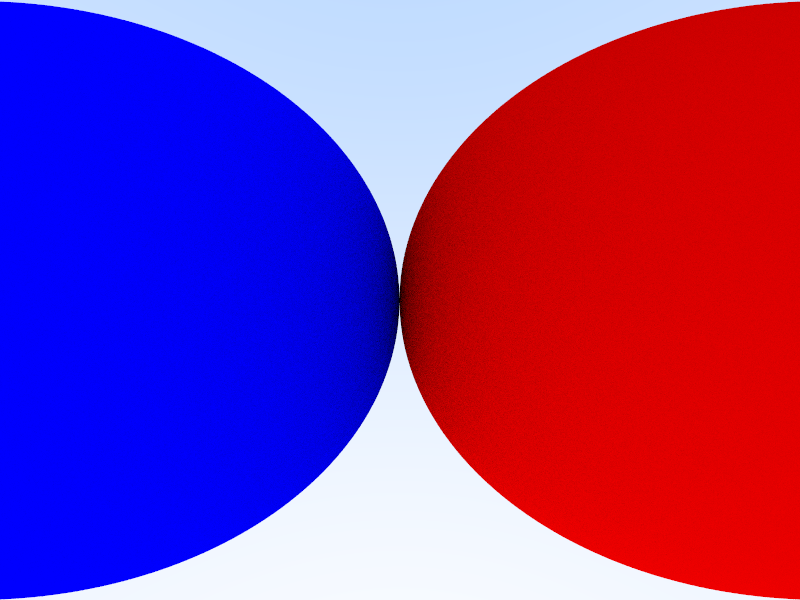
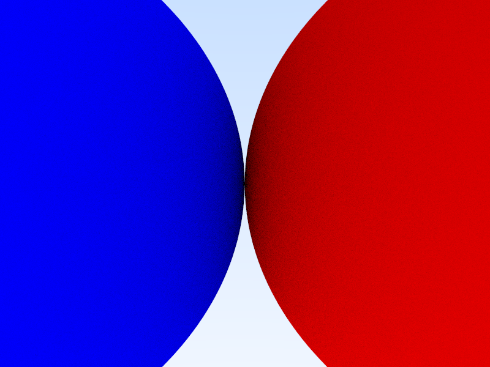

# Camera

摄像头总是会变动，由此得到不同的视角。

## fov

fov是视野的宽广程度，这个很简单，懒得说了。

为Camera添加一个fov项，修正其viewport。

为修正前的Camera能看见[-1,1]整个平面的物体，但是经过修正后，将被限制到fov视角范围内。

```c++
Camera(
		double fov,
		double aspect_ratio) {
		//viewport相当于摄像机的镜头
		double theta = degrees_to_radians(fov);
		double h = tan(theta / 2);
		double viewport_height = 2.0 * h;
		double viewport_width = aspect_ratio * viewport_height;
		double focal_length = 1.0;//焦距

		origin = Point3(0, 0, 0);
		horizontal = Vec3(viewport_width, 0, 0);
		vertical = Vec3(0, viewport_height, 0);
		lower_left_corner = origin - horizontal / 2 - vertical / 2 - Vec3(0, 0, focal_length); //我想理解成(l,b,n)
	}
```

**令fov为90**



**令fov为60**



显而易见，可视范围变小了。

## 位置与角度

Camera的position和rotation也是可变的，所幸这两个变量只需要用三个`Point3`类型就可以表示。

`LookFrom`and`LookAt`以及`camera_up`

根据这三个Point3，可以构建一个新的摄像机坐标系，并以此为新的基向量构建viewport。

